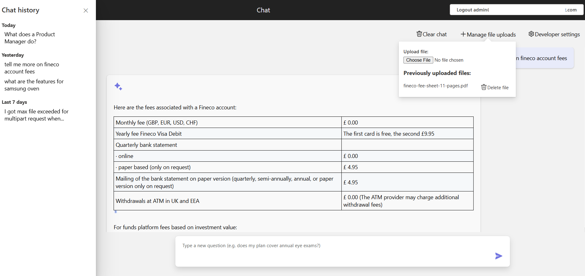
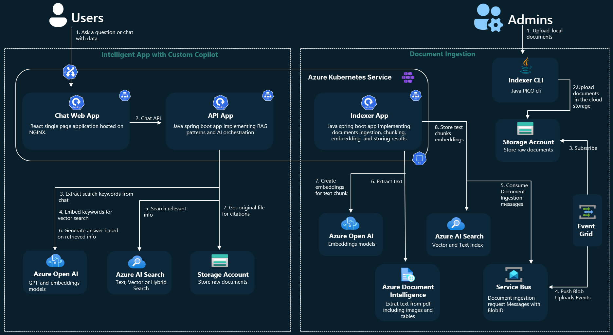
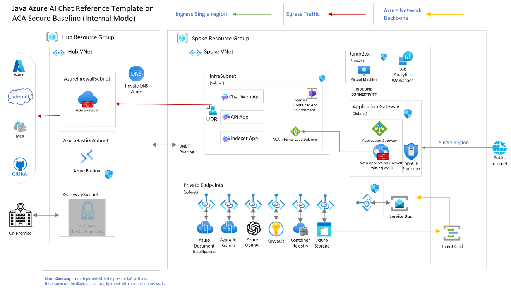

<!-- YAML front-matter schema: https://review.learn.microsoft.com/en-us/help/contribute/samples/process/onboarding?branch=main#supported-metadata-fields-for-readmemd -->

# ChatGPT + Enterprise data with Azure OpenAI and Azure AI Search - Java Version

This repo is the Java version of the well known [ChatGPT + Enterprise data code sample](https://github.com/Azure-Samples/azure-search-openai-demo) originally written in python.

It demonstrates best practices for creating ChatGPT-like experiences over your own data using the Retrieval Augmented Generation pattern. It uses Azure OpenAI Service to access the ChatGPT model `gpt-35-turbo`, and Azure Azure AI Search for data indexing and retrieval.

This repository includes sample data so it's ready to try end to end. In this sample application we use a fictitious company called Contoso Electronics, and the experience allows its employees to ask questions about the benefits, internal policies, as well as job descriptions and roles.

## Features

What this demo application does:
* Chat and Q&A interfaces
* Explores various options to help users evaluate the trustworthiness of responses with citations, tracking of source content, etc.
* Shows possible approaches for data preparation, prompt construction, and orchestration of interaction between model (ChatGPT) and retriever (Azure AI Search)
* Shows possible AI orchestration implementation using the plain Java Open AI sdk or the Java Semantic Kernel sdk
* Settings directly in the UX to tweak the behavior and experiment with options

### Solution architecture and deployment options

This sample supports different architectural styles. It can be deployed as standalone app on top of Azure App Service or as a microservice event driven architecture with web frontend, AI orchestration and document ingestion apps hosted by Azure Container Apps or Azure Kubernetes Service.

- For **Azure App Service** deployment, see [here](docs/app-service/README-App-Service.md).
- For **Azure Container Apps** deployment, see [here](docs/aca/README-ACA.md).
- For **Azure Kubernetes Service** deployment, see [here](docs/aks/README-AKS.md).

### RAG implementation options
This repo is focused to showcase different options to implement **"chat with your private documents"** scenario using RAG patterns with Java, Azure OpenAI and Semantic Kernel.
Below you can find the list of available implementations.

| Conversational Style | RAG Approach                                                                                                                                                                                                                                                         | Description                                                                                                                                                                                                                                                                                                                                                                                                                                                                                                                                                                                                                                                                                                                                     | Java Open AI SDK                                                                               | Java Semantic Kernel  | 
|:---------------------|:---------------------------------------------------------------------------------------------------------------------------------------------------------------------------------------------------------------------------------------------------------------------|:------------------------------------------------------------------------------------------------------------------------------------------------------------------------------------------------------------------------------------------------------------------------------------------------------------------------------------------------------------------------------------------------------------------------------------------------------------------------------------------------------------------------------------------------------------------------------------------------------------------------------------------------------------------------------------------------------------------------------------------------|:-----------------------------------------------------------------------------------------------|:----------------------|
| One Shot Ask         | [PlainJavaAskApproach](https://github.com/Azure-Samples/azure-search-openai-demo-java/blob/main/app/backend/src/main/java/com/microsoft/openai/samples/rag/ask/approaches/PlainJavaAskApproach.java)                                                                 | Use Azure AI Search and Java OpenAI APIs. It first retrieves top documents from search and use them to build a prompt. Then, it uses OpenAI to generate an answer for the user question.Several search retrieval options are available: Text, Vector, Hybrid. When Hybrid and Vector are selected an additional call to OpenAI is required to generate embeddings vector for the question.                                                                                                                                                                                                                                                                                                                                                      | :white_check_mark:                                                                             | :x:                   |
| Chat                 | [PlainJavaChatApproach](https://github.com/Azure-Samples/azure-search-openai-demo-java/blob/main/app/backend/src/main/java/com/microsoft/openai/samples/rag/chat/approaches/PlainJavaChatApproach.java)                                                              | Use Azure AI Search and Java OpenAI APIs. It first calls OpenAI to generate a search keyword for the chat history and then answer to the last chat question. Several search retrieval options are available: Text, Vector, Hybrid. When Hybrid and Vector are selected an additional call to OpenAI is required to generate embeddings vector for the chat extracted keywords.                                                                                                                                                                                                                                                                                                                                                                  | :white_check_mark:                                                                             | :x:                   |
| One Shot Ask         | [JavaSemanticKernelWithVectorStoreApproach](https://github.com/Azure-Samples/azure-search-openai-demo-java/blob/main/app/backend/src/main/java/com/microsoft/openai/samples/rag/ask/approaches/semantickernel/JavaSemanticKernelWithMemoryApproach.java)             | Use Java Semantic Kernel framework with built-in VectorStore for embeddings similarity search. A semantic function [RAG.AnswerQuestion](https://github.com/Azure-Samples/azure-search-openai-demo-java/blob/main/app/backend/src/main/resources/semantickernel/Plugins/RAG/AnswerQuestion/config.json) is defined to build the prompt using vector search results. An AzureAISearchVectorStoreRecordCollection instance is used to manage the AzureAISearch index populated by the documents ingestion process.                                                                                                                                                                                                                                 | :x:                                                                                            | :white_check_mark: |
| One Shot Ask         | [JavaSemanticKernelChainsApproach](https://github.com/Azure-Samples/azure-search-openai-demo-java/blob/main/app/backend/src/main/java/com/microsoft/openai/samples/rag/ask/approaches/semantickernel/JavaSemanticKernelChainsApproach.java)                          | Use Java Semantic Kernel framework with semantic and native functions chaining. It uses an imperative style for AI orchestration through semantic kernel functions chaining. [InformationFinder.SearchFromQuestion](https://github.com/Azure-Samples/azure-search-openai-demo-java/blob/main/app/backend/src/main/java/com/microsoft/openai/samples/rag/retrieval/semantickernel/AzureAISearchPlugin.java) native function and [RAG.AnswerQuestion](https://github.com/Azure-Samples/azure-search-openai-demo-java/blob/main/app/backend/src/main/resources/semantickernel/Plugins/RAG/AnswerQuestion/config.json) semantic function are called sequentially. Several search retrieval options are available: Text, Vector, Hybrid.             | :x:                                                                                            | :white_check_mark:    |
| Chat                 | [JavaSemanticKernelWithVectorStoreApproach](https://github.com/Azure-Samples/azure-search-openai-demo-java/blob/main/app/backend/src/main/java/com/microsoft/openai/samples/rag/chat/approaches/semantickernel/JavaSemanticKernelWithMemoryChatApproach.java.ignore) | Use Java Semantic Kernel framework with built-in VectorStore for embeddings similarity search. A semantic function [RAG.AnswerConversation](https://github.com/Azure-Samples/azure-search-openai-demo-java/blob/main/app/backend/src/main/resources/semantickernel/Plugins/RAG/AnswerQuestion/config.json) is defined to build the prompt using vector search results. An AzureAISearchVectorStoreRecordCollection instance is used to manage an AzureAISearch index populated by the documents ingestion process.                                                                                                                                                                                                                              | :x:                                                                                            | :white_check_mark:  |
| Chat                 | [JavaSemanticKernelChainsApproach](https://github.com/Azure-Samples/azure-search-openai-demo-java/blob/main/app/backend/src/main/java/com/microsoft/openai/samples/rag/chat/approaches/semantickernel/JavaSemanticKernelChainsChatApproach.java)                     | Use Java Semantic Kernel framework with semantic and native functions chaining. It uses an imperative style for AI orchestration through semantic kernel functions chaining. [InformationFinder.SearchFromConversation](https://github.com/Azure-Samples/azure-search-openai-demo-java/blob/main/app/backend/src/main/java/com/microsoft/openai/samples/rag/retrieval/semantickernel/AzureAISearchPlugin.java) native function and [RAG.AnswerConversation](https://github.com/Azure-Samples/azure-search-openai-demo-java/blob/main/app/backend/src/main/resources/semantickernel/Plugins/RAG/AnswerConversation/config.json) semantic function are called sequentially. Several search retrieval options are available: Text, Vector, Hybrid. | :x:                                                                                            | :white_check_mark:    |

## Getting Started

All the available architectures and implementations come with few options to start developing and running the application locally using dev containers or in the cloud using github codespaces. For more detailed instructions, please refer to the specific architecture implementation documentation:
 - [App Service Getting Started](docs/app-service/README-App-Service.md#getting-started)
 - [Azure Container Apps Getting Started](docs/aca/README-ACA.md#getting-started)
 - [Azure Kubernetes Service Getting Started](docs/aks/README-AKS.md#getting-started)

## Guidance
For platform specific guidance, please refer to the following documentation:
 - [App Service Guidance](docs/app-service/README-App-Service.md#guidance)
 - [Azure Container Apps Getting Started](docs/aca/README-ACA.md#guidance)
 - [Azure Kubernetes Service Getting Started](docs/aks/README-AKS.md#guidance)

- [App Service Guidance]
This sample is designed to get you started quickly and let you experiment with Java intelligent Apps RAG architectures on Azure. For production deployment, you can use the [Azure Application Landing Zones (LZA)](https://learn.microsoft.com/en-us/azure/cloud-adoption-framework/scenarios/app-platform/ready) to deploy the solution maintaining best practices for security, monitoring, networking and operational excellence.

Check the [chat-with-your-data-lza-app-accelerator](https://github.com/dantelmomsft/chat-with-your-data-java-lza-app-accelerator) to see how you can deploy this solution on App Service LZA or Azure Container Apps LZA.

### Resources

* [📖 Revolutionize your Enterprise Data with ChatGPT: Next-gen Apps w/ Azure OpenAI and AI Search](https://aka.ms/entgptsearchblog)
* [📖 Azure OpenAI Service](https://learn.microsoft.com/azure/cognitive-services/openai/overview)
* [📖 RAG in Azure AI Search](https://learn.microsoft.com/en-us/azure/search/retrieval-augmented-generation-overview)
* [📖 Azure OpenAI client library for Java](https://learn.microsoft.com/en-us/java/api/overview/azure/ai-openai-readme?view=azure-java-preview)
* [📖 Semantic Kernel for Java 1.0](https://devblogs.microsoft.com/semantic-kernel/java-1-0-release-candidate-for-semantic-kernel-now-available/)
* [📖 Evaluating a RAG chat App](https://github.com/Azure-Samples/ai-rag-chat-evaluator)
* [📖 Well Architected Framework on Azure OpenAI Service](https://learn.microsoft.com/en-us/azure/well-architected/service-guides/azure-openai)
* [📺 Chat with your data using Java and Azure Open AI](https://www.youtube.com/watch?v=mcftrg6L8Fs&t=57s)
* [📺 Vector Search, RAG, And Azure AI Search](https://www.youtube.com/watch?v=vuOA13Y_Qzk)
