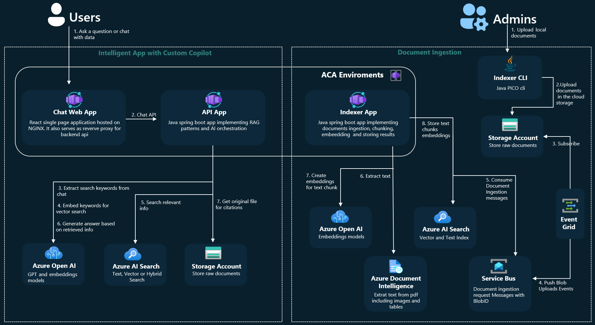
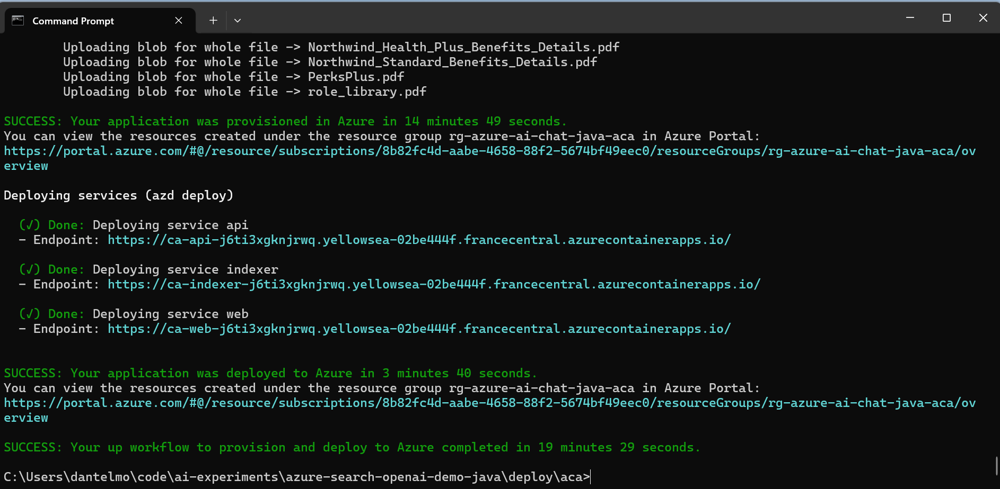
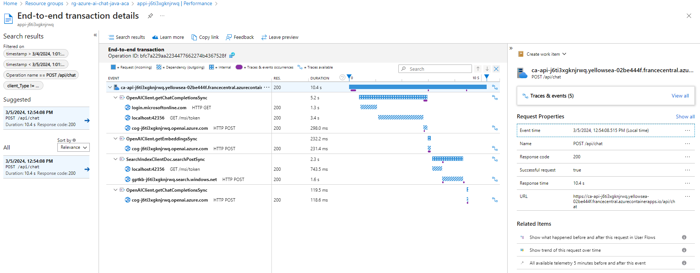

# Microservice based architecture deployed on Azure Container Apps



* The API app is implemented as springboot 2.7.x app using the Microsoft JDK. It provides the ask and chat apis which are used by the chat web app. It's responsible for implementing the RAG pattern orchestrating the interaction between the LLM model (Open AI - ChatGPT) and the retriever (Azure AI Search).
* The Chat Web App is built in React and deployed as a static web app on nginx. Furthermore Nginx act as reverse proxy for api calls to the API app. This also solves the CORS issue.
* The indexer APP is implemented as springboot 2.7.x app using the Microsoft JDK. It is responsible for indexing the data into Azure Cognitive Search and it's triggered by new BlobUploaded messages from serviceBus. The indexer is also responsible for chunking the documents into smaller pieces, embed them and store them in the index. Azure Document Intelligence is used to extract text from PDF documents (including tables and images)
* Azure AI Search is used as RAG retrieval system. Different search options are available: you have traditional full text (with semantic search) search, or vector based search and finally you can opt for hybrid search which brings together the best of the previous ones.
* EventGrid System topic is used to implement a real time mechanism to trigger the indexer app when a new document is uploaded to the blob storage. It's responsible to read BlobUploaded notification from azure storage container and push a message to the service bus queue containing the blob url.

## TL;DR

Open the project:

[](https://github.com/codespaces/new?hide_repo_select=true&ref=main&repo=687400781&machine=standardLinux32gb&devcontainer_path=.devcontainer%2Fdevcontainer.json&location=WestUs2)
[](https://vscode.dev/redirect?url=vscode://ms-vscode-remote.remote-containers/cloneInVolume?url=https://github.com/azure-samples/azure-search-openai-demo-java/)

Open the terminal and run:

```shell
cd deploy/aca
azd auth login
azd up
```

For detailed instructions, see [Getting Started](#getting-started) below.

## Table of contents

<!-- TOC -->
* [Getting Started](#getting-started)
  * [Run in GitHub Codespaces or VS Code Dev Containers](#run-in-github-codespaces-or-vs-code-dev-containers) 
  * [Prerequisites](#prerequisites)
  * [Starting from scratch](#starting-from-scratch)
  * [Deploying with existing Azure resources](#deploying-with-existing-azure-resources)
    * [Existing resource group](#existing-resource-group)
    * [Existing OpenAI resource](#existing-openai-resource)
    * [Existing Azure Azure AI Search resource](#existing-azure-ai-search-resource)
    * [Other existing Azure resources](#other-existing-azure-resources)
    * [Provision remaining resources](#provision-remaining-resources)
  * [Deploying again](#redeploying)
  * [Running locally](#running-locally)
  * [UI Navigation](#ui-navigation)
* [Guidance](#guidance)
  * [Enabling Application Insights](#enabling-application-insights)
  * [Enabling authentication](#enabling-authentication)
  * [App Continuous Integration](#app-continuous-integration)
    * [GitHub](#github)
    * [Azure DevOps](#azure-devops)
  * [Custom Data Ingestion and Indexing](#custom-data-ingestion-and-indexing)
  * [Productionizing](#productionizing)
  * [Cost estimation](#cost-estimation)
  * [Note](#note)
  * [FAQ](#faq)
  * [Troubleshooting](#troubleshooting)
<!-- TOC -->


## Getting Started

> **IMPORTANT:** In order to deploy and run this example, you'll need an **Azure subscription with access enabled for the Azure OpenAI Service**. You can request access [here](https://aka.ms/oaiapply). You can also visit [here](https://azure.microsoft.com/free/) to get some free Azure credits to get you started.

### Run in GitHub Codespaces or VS Code Dev Containers

You can run this repo virtually by using GitHub Codespaces or VS Code Dev Containers.  Click on one of the buttons below to open this repo in one of those options.

[](https://github.com/codespaces/new?hide_repo_select=true&ref=main&repo=687400781&machine=standardLinux32gb&devcontainer_path=.devcontainer%2Fdevcontainer.json&location=WestUs2)
[](https://vscode.dev/redirect?url=vscode://ms-vscode-remote.remote-containers/cloneInVolume?url=https://github.com/azure-samples/azure-search-openai-demo-java/)

All prerequisites are already installed in the container.  You can skip to the [Starting from scratch](#starting-from-scratch) section.

### Prerequisites

* [Java 17](https://learn.microsoft.com/en-us/java/openjdk/download#openjdk-17)
* [Maven 3.8.x](https://maven.apache.org/download.cgi)
* [Azure Developer CLI](https://aka.ms/azure-dev/install)
* [Node.js](https://nodejs.org/en/download/)
* [Git](https://git-scm.com/downloads)
* [Powershell 7+ (pwsh)](https://github.com/powershell/powershell) - For Windows users only.
  * **Important**: Ensure you can run `pwsh.exe` from a PowerShell command. If this fails, you likely need to upgrade PowerShell.


>[!WARNING] Your Azure Account must have `Microsoft.Authorization/roleAssignments/write` permissions, such as [User Access Administrator](https://learn.microsoft.com/azure/role-based-access-control/built-in-roles#user-access-administrator) or [Owner](https://learn.microsoft.com/azure/role-based-access-control/built-in-roles#owner).  

### Starting from scratch

You can clone this repo and change directory to the root of the repo. Or you can run `azd init -t Azure-Samples/azure-search-openai-demo-java`.

Once you have the project available locally, run the following commands if you don't have any pre-existing Azure services and want to start from a fresh deployment.
> [!IMPORTANT]
> All the commands below must be run from the `deploy/aca` folder

1. Run 

    ```shell
    azd auth login
    ```

2. Run 

    ```shell
    azd up
    ```
    
    * This will provision Azure resources and deploy this sample to those resources, including building the search index based on the files found in the `./data` folder.
    * For the target location, the regions that currently support the models used in this sample are **East US**, **France Central**, **South Central US**, **UK South**, and **West Europe**. For an up-to-date list of regions and models, check [here](https://learn.microsoft.com/en-us/azure/ai-services/openai/concepts/models)

3. After the application has been successfully deployed you will see a web app URL printed to the console.  Click that URL to interact with the application in your browser.  

It will look like the following:



> NOTE: It may take few minutes for the indexer app to consume the pdf ingestion request messages from service bus. You can monitor the ingestion process by checking the log stream of the indexer app in the Azure Portal.

### Deploying with existing Azure resources

If you already have existing Azure resources, you can re-use those by setting `azd` environment values.

#### Existing resource group

1. Run `azd env set AZURE_RESOURCE_GROUP {Name of existing resource group}`
1. Run `azd env set AZURE_LOCATION {Location of existing resource group (i.e eastus2)}`

#### Existing OpenAI resource

1. Run `azd env set AZURE_OPENAI_SERVICE {Name of existing OpenAI service}`
1. Run `azd env set AZURE_OPENAI_RESOURCE_GROUP {Name of existing resource group that OpenAI service is provisioned to}`
1. Run `azd env set AZURE_OPENAI_SERVICE_LOCATION {Location of existing resource (i.e eastus2)}`. Only needed if your OpenAI resource is in a different location than the one you'll pick for the `azd up` step.
1. Run `azd env set AZURE_OPENAI_CHATGPT_DEPLOYMENT {Name of existing ChatGPT deployment}`. Only needed if your ChatGPT deployment is not the default 'chat'.
1. Run `azd env set AZURE_OPENAI_EMB_DEPLOYMENT {Name of existing GPT embedding deployment}`. Only needed if your embeddings deployment is not the default 'embedding'.

#### Existing Azure AI Search resource

1. Run `azd env set AZURE_SEARCH_SERVICE {Name of existing Azure AI Search service}`
1. Run `azd env set AZURE_SEARCH_SERVICE_RESOURCE_GROUP {Name of existing resource group with ACS service}`
1. If that resource group is in a different location than the one you'll pick for the `azd up` step,
   then run `azd env set AZURE_SEARCH_SERVICE_LOCATION {Location of existing service}`
1. If the search service's SKU is not standard, then run `azd env set AZURE_SEARCH_SERVICE_SKU {Name of SKU}`. The free tier won't work as it doesn't support managed identity. ([See other possible values](https://learn.microsoft.com/azure/templates/microsoft.search/searchservices?pivots=deployment-language-bicep#sku))

#### Other existing Azure resources

You can also use existing Form Recognizer and Storage Accounts. See `./infra/main.parameters.json` for list of environment variables to pass to `azd env set` to configure those existing resources.

#### Provision remaining resources

Now you can run `azd up`, following the steps in [Deploying from scratch](#deploying-from-scratch) above.
That will both provision resources and deploy the code.


### Redeploying

If you've only changed the backend/frontend code in the `app` folder, then you don't need to re-provision the Azure resources. You can just run:

```shell
azd deploy
```

If you've changed the infrastructure files (`infra` folder or `azure.yaml`), then you'll need to re-provision the Azure resources. You can do that by running:

```shell
azd up
```
 > [!WARNING]
 > When you run `azd up` multiple times to redeploy infrastructure, make sure to set the following parameters in `infra/main.parameters.json` to `true` to avoid container apps images from being overridden with default "mcr.microsoft.com/azuredocs/containerapps-helloworld" image:

```json
"apiAppExists": {
    "value": true
  },
  "webAppExists": {
    "value": true
  },
  "indexerAppExists": {
    "value": true
  }
```

### Examples of an azd deployment changing the default chatgpt deployment model
```shell
azd auth login
azd env set AZURE_OPENAI_CHATGPT_MODEL "gpt-4" # Change the chatgpt model to gpt-4
azd up
```
> NOTE: This sample has been tested with gpt-35-turbo/0613 model version.Using other models or different versions might result in unexpected behavior.
### Examples of an azd deployment reusing an existing Azure OpenAI and Azure AI Search resources

```shell
azd auth login
azd init -t Azure-Samples/azure-search-openai-demo-java.

azd env set AZURE_RESOURCE_GROUP "openai-test-resource-group" # Target resource group for the new resources
azd env set AZURE_LOCATION "eastus" # Target region for the new resources

azd env set AZURE_OPENAI_SERVICE "my-openai-test-service" # Name of the OpenAI service
azd env set AZURE_OPENAI_RESOURCE_GROUP "my-openai-test-resource-group" # Resource group where the OpenAI service is deployed
azd env set AZURE_OPENAI_SERVICE_LOCATION "eastus2" # Region of the OpenAI service
azd env set AZURE_OPENAI_CHATGPT_DEPLOYMENT "gpt-35-turbo" # The "Deployment name" of the deployed model, deployed in the Azure OpenAI studio
azd env set AZURE_OPENAI_EMB_DEPLOYMENT "text-embedding-ada-002"  # The "Deployment name" of the deployed model, deployed in the Azure OpenAI studio

azd env set AZURE_SEARCH_SERVICE "my-acs-test-service" # Name of the ACS service
azd env set AZURE_SEARCH_SERVICE_RESOURCE_GROUP "my-acs-test-resource-group" # Resource group where the ACS service is deployed
azd env set AZURE_SEARCH_SERVICE_LOCATION "eastus2" # Region of the ACS service

azd up
```

### Running locally

1. Run

    ```shell
    az login
    ```

2. Change dir to `deploy/aca`

    ```shell
    cd deploy/aca
    ```

3. Run the `./start-compose.ps1` (Windows) or `./start-compose.sh` (Linux/Mac) scripts or run the "VS Code Task: Start App" to start the project locally.
4. Wait for the docker compose to start all the containers (web, api, indexer) and refresh your browser to [http://localhost](http://localhost)

### UI Navigation

* In Azure: navigate to the Web App deployed by azd. The URL is printed out when azd completes (as "Endpoint"), or you can find it in the Azure portal.
* Running locally: navigate to localhost:8080

Once in the web app:

* Try different topics in chat or Q&A context. For chat, try follow-up questions, clarifications, ask to simplify or elaborate on answer, etc.
* Explore citations and sources
* Click on "settings" to try different options, tweak prompts, etc.


## Guidance

### Enabling Application Insights

Applications Insights is enabled by default. It allows to investigate each request tracing along with the logging of errors.

If you want to disable it set the `AZURE_USE_APPLICATION_INSIGHTS` variable to false before running `azd up`

1. Run `azd env set AZURE_USE_APPLICATION_INSIGHTS false`
1. Run `azd up`

To see the performance data, go to the Application Insights resource in your resource group, click on the "Investigate -> Performance" blade and navigate to any HTTP request to see the timing data.
To inspect the performance of chat requests, use the "Drill into Samples" button to see end-to-end traces of all the API calls made for any chat request.
Under "Trace & Events" panel you can review custom Java informational logs to better understand content of OpenAI requests and responses.



To see any exceptions and server errors, navigate to the "Investigate -> Failures" blade and use the filtering tools to locate a specific exception. You can see Java stack traces on the right-hand side.

### Enabling authentication

By default, the web app on ACA will have no authentication or access restrictions enabled, meaning anyone with routable network access to the web app can chat with your indexed data.You can require authentication to your Microsoft Entra by following the [Add app authentication](https://learn.microsoft.com/en-us/azure/container-apps/authentication) tutorial and set it up against the deployed web app.


To then limit access to a specific set of users or groups, you can follow the steps from [Restrict your Microsoft Entra app to a set of users](https://learn.microsoft.com/entra/identity-platform/howto-restrict-your-app-to-a-set-of-users) by changing "Assignment Required?" option under the Enterprise Application, and then assigning users/groups access.  Users not granted explicit access will receive the error message -AADSTS50105: Your administrator has configured the application <app_name> to block users 

### App Continuous Integration
:sunny: :cloud: :construction_worker_man: WIP

### Custom Data Ingestion and Indexing
The repository includes sample pdf documents in the data folder. They are ingested in blob container and then indexed in Azure AI Search during infra provisioning by Azure Developer CLI post provision hooks.

If you want to chat with your custom documents you can:
1. Add your pdf documents in the [data folder](../../data).
2. Open a terminal and cd to repo root folder for app service deployment. Example `cd path/to/your/custom/dir/azure-search-openai-demo-java/deploy/aca` 
3. Run `./scripts/prepdocs.ps1` if you are on windows or `./scripts/prepdocs.sh` on linux
4. Wait few minutes after the script complete so that the ingestion process, running on the indexer app, will ingest all the documents. This is not a 'delta' process, it's not updating **only** the new files you've added. Instead, on each run, all documents in data folder will be ingested. Feel free to add new files you want to ingest and delete/move the old documents from the data folder. Once you've run the script and it completes successfully, Azure AI Search index has been updated and stored (until you want to manually delete it from your azure Azure AI Search instance)

### Productionizing

This sample is designed to be a starting point for your own production application,
but you should do a thorough review of the security and performance before deploying
to production. Here are some things to consider:

* **OpenAI Capacity**: The default TPM (tokens per minute) is set to 60K for gpt and 80k for embeddings. That is equivalent
  to approximately 60 conversations per minute (assuming 1K per user message/response).
  You can increase the capacity by changing the `chatGptDeploymentCapacity` and `embeddingDeploymentCapacity`
  parameters in `infra/main.bicep` to your account's maximum capacity.
  You can also view the Quotas tab in [Azure OpenAI studio](https://oai.azure.com/)
  to understand how much capacity you have.
* **Azure Storage**: The default storage account uses the `Standard_LRS` SKU.
  To improve your resiliency, we recommend using `Standard_ZRS` for production deployments,
  which you can specify using the `sku` property under the `storage` module in `infra/main.bicep`.
* **Azure AI Search**: The default search service uses the `Standard` SKU
  with the free semantic search option, which gives you 1000 free queries a month.
  Assuming your app will experience more than 1000 questions, you should either change `semanticSearch`
  to "standard" or disable semantic search entirely in the `/app/backend/approaches` files.
  If you see errors about search service capacity being exceeded, you may find it helpful to increase
  the number of replicas by changing `replicaCount` in `infra/core/search/search-services.bicep`
  or manually scaling it from the Azure Portal.
* **Azure Containers App**: Consumption workload profile is used with 4 CPU core and 8 GB RAM to host all the 3 apps.
  We recommend to use Dedicated profile and select one from the available [types](https://learn.microsoft.com/en-us/azure/container-apps/workload-profiles-overview#profile-types) based on your capacity needs.
  You can use auto-scaling rules or scheduled scaling rules,
  and scale up the maximum/minimum based on load.
* **Service Bus**: Standard SKU is used. Consider to use Premium SKU to enable redundancy and predictable performance with high throughput.
* **Event Grid**: Event Grid basic is used. Consider to use Event Grid Standard tier if the ingestion requests rates are high (> 5MB/s). Only BlobId are sent in the event  grid events. The blob content is not sent.
  **Authentication**: By default, the deployed app is publicly accessible.
  We recommend restricting access to authenticated users.
 * **Networking**: We recommend deploying inside a Virtual Network. If the app is only for
  internal enterprise use, use a private DNS zone. Also consider using Azure API Management (APIM)
  for firewalls and other forms of protection.
  For more details, read [Azure OpenAI Landing Zone reference architecture](https://techcommunity.microsoft.com/t5/azure-architecture-blog/azure-openai-landing-zone-reference-architecture/ba-p/3882102).
* **Loadtesting**: We recommend running a loadtest for your expected number of users.
  You can use [Azure Load Test](https://learn.microsoft.com/en-us/azure/load-testing/quickstart-create-and-run-load-test?tabs=virtual-users) with [Apache Jmeter](https://learn.microsoft.com/en-us/azure/load-testing/how-to-create-and-run-load-test-with-jmeter-script)

### Cost estimation

Pricing varies per region and usage, so it isn't possible to predict exact costs for your usage.
However, you can try the [Azure pricing calculator](https://azure.com/e/8ffbe5b1919c4c72aed89b022294df76) for the resources below.

- Azure Containers App: Consumption workload profile with 4 CPU core and 8 GB RAM. Pricing per vCPU and Memory. [Pricing](https://azure.microsoft.com/en-us/pricing/details/container-apps/)
- Azure OpenAI: Standard tier, ChatGPT and Ada models. Pricing per 1K tokens used, and at least 1K tokens are used per question. [Pricing](https://azure.microsoft.com/en-us/pricing/details/cognitive-services/openai-service/)
- Form Recognizer: SO (Standard) tier using pre-built layout. Pricing per document page, sample documents have 261 pages total. [Pricing](https://azure.microsoft.com/pricing/details/form-recognizer/)
- Azure AI Search: Standard tier, 1 replica, free level of semantic search. Pricing per hour.[Pricing](https://azure.microsoft.com/pricing/details/search/)
- Azure Blob Storage: Standard tier with ZRS (Zone-redundant storage). Pricing per storage and read operations. [Pricing](https://azure.microsoft.com/pricing/details/storage/blobs/)
- Azure Monitor: Pay-as-you-go tier. Costs based on data ingested. [Pricing](https://azure.microsoft.com/pricing/details/monitor/)
- Azure Event Grid: Basic tier. Pricing per operation. [Pricing](https://azure.microsoft.com/pricing/details/event-grid/)
- Azure Service Bus: Standard tier. Pricing per hour and operations. [Pricing](https://azure.microsoft.com/pricing/details/service-bus/)

The first 180,000 vCPU-seconds, 360,000 GiB-seconds, and 2 million requests each month are free for ACA. To reduce costs, you can switch to free SKUs Form Recognizer by changing the parameters file under the `infra` folder. There are some limits to consider; for example, the free Form Recognizer resource only analyzes the first 2 pages of each document. You can also reduce costs associated with the Form Recognizer by reducing the number of documents in the `data` folder, or changing the code to use the Itext document based parser, or by removing the postprovision hook in `azure.yaml` that runs the `indexer java cli`.

⚠️ To avoid unnecessary costs, remember to take down your app if it's no longer in use,
either by deleting the resource group in the Portal or running `azd down`.

### Note

>Note: The PDF documents used in this demo contain information generated using a language model (Azure OpenAI Service). The information contained in these documents is only for demonstration purposes and does not reflect the opinions or beliefs of Microsoft. Microsoft makes no representations or warranties of any kind, express or implied, about the completeness, accuracy, reliability, suitability or availability with respect to the information contained in this document. All rights reserved to Microsoft.

### FAQ

<details>
<summary>Why do we need to break up the PDFs into chunks when Azure AI Search supports searching large documents?</summary>

Chunking allows us to limit the amount of information we send to OpenAI due to token limits. By breaking up the content, it allows us to easily find potential chunks of text that we can inject into OpenAI. The method of chunking we use leverages a sliding window of text such that sentences that end one chunk will start the next. This allows us to reduce the chance of losing the context of the text.
</details>

<details><a id="ingestion-more-pdfs"></a>
<summary>How can we upload additional PDFs without redeploying everything?</summary>

To upload more PDFs, put them in the data/ folder and run `./scripts/prepdocs.sh` or `./scripts/prepdocs.ps1`. To avoid reuploading existing docs, move them out of the data folder. You could also implement checks to see whats been uploaded before; our code doesn't yet have such checks.
</details>

<details><a id="switch-gpt4"></a>
<summary>How do you use GPT-4 with this sample?</summary>

In `infra/main.bicep`, change `chatGptModelName` to 'gpt-4' instead of 'gpt-35-turbo'. You may also need to adjust the capacity above that line depending on how much TPM your account is allowed.
</details>

<details><a id="chat-ask-diff"></a>
<summary>What is the difference between the Chat and Ask tabs?</summary>

The chat tab uses the approach programmed in [PlainJavaChatApproach](https://github.com/Azure-Samples/azure-search-openai-demo-java/blob/main/app/backend/src/main/java/com/microsoft/openai/samples/rag/chat/approaches/PlainJavaChatApproach.java).

- It uses the ChatGPT API to turn the user question into a good search query.
- It queries Azure AI Search for search results for that query (optionally using the vector embeddings for that query).
- It then combines the search results and original user question, and asks ChatGPT API to answer the question based on the sources. It includes the last 4K of message history as well (or however many tokens are allowed by the deployed model).

The ask tab uses the approach programmed in [PlainJavaChatApproach](https://github.com/Azure-Samples/azure-search-openai-demo-java/blob/main/app/backend/src/main/java/com/microsoft/openai/samples/rag/chat/approaches/PlainJavaChatApproach.java).

- It queries Azure AI Search for search results for the user question (optionally using the vector embeddings for that question).
- It then combines the search results and user question, and asks ChatGPT API to answer the question based on the sources.

There are also three other /ask approaches which are implemented using **Java Semantic Kernel** sdk. Development it's still experimental and it will be consolidated as soon as semantic kernel beta version will be released. Below a brief description of the SK integration status:
</details>

<details><a id="azd-up-explanation"></a>
<summary>What does the `azd up` command do?</summary>

The `azd up` command comes from the [Azure Developer CLI](https://learn.microsoft.com/en-us/azure/developer/azure-developer-cli/overview), and takes care of both provisioning the Azure resources and deploying code to the selected Azure hosts.

The `azd up` command uses the `azure.yaml` file combined with the infrastructure-as-code `.bicep` files in the `infra/` folder. The `azure.yaml` file for this project declares several "hooks" for the prepackage step and postprovision steps. The `up` command first runs the `prepackage` hook which installs Node dependencies and builds the React.JS-based JavaScript files. It then packages all the code (both frontend and backend) into a zip file which it will deploy later.

Next, it provisions the resources based on `main.bicep` and `main.parameters.json`. At that point, since there is no default value for the OpenAI resource location, it asks you to pick a location from a short list of available regions. Then it will send requests to Azure to provision all the required resources. With everything provisioned, it runs the `postprovision` hook to process the local data and add it to an Azure AI Search index.

Finally, it looks at `azure.yaml` to determine the Azure host (appservice, in this case) and uploads the zip to Azure App Service. The `azd up` command is now complete, but it may take another 5-10 minutes for the App Service app to be fully available and working, especially for the initial deploy.

Related commands are `azd provision` for just provisioning (if infra files change) and `azd deploy` for just deploying updated app code.
</details>

<details><a id="appservice-logs"></a>
<summary>How can we view logs from the App Service app?</summary>

You can view production logs in the Portal using either the Log stream or by downloading the default_docker.log file from Advanced tools.
</details>

### Troubleshooting

Here are the most common failure scenarios and solutions:

1. The subscription (`AZURE_SUBSCRIPTION_ID`) doesn't have access to the Azure OpenAI Service. Please ensure `AZURE_SUBSCRIPTION_ID` matches the ID specified in the [OpenAI access request process](https://aka.ms/oai/access).

2. You're attempting to create resources in regions not enabled for Azure OpenAI (e.g. East US 2 instead of East US), or where the model you're trying to use isn't enabled. See [this matrix of model availability](https://aka.ms/oai/models).

3. You've exceeded a quota, most often number of resources per region. See [this article on quotas and limits](https://aka.ms/oai/quotas).

4. You're getting "same resource name not allowed" conflicts. That's likely because you've run the sample multiple times and deleted the resources you've been creating each time, but are forgetting to purge them. Azure keeps resources for 48 hours unless you purge from soft delete. See [this article on purging resources](https://learn.microsoft.com/azure/cognitive-services/manage-resources?tabs=azure-portal#purge-a-deleted-resource).

5. You see `CERTIFICATE_VERIFY_FAILED` when the `prepdocs.py` script runs. That's typically due to incorrect SSL certificates setup on your machine. Try the suggestions in this [StackOverflow answer](https://stackoverflow.com/questions/35569042/ssl-certificate-verify-failed-with-python3/43855394#43855394).

6. After running `./app/start.ps1` on Windows PowerShell you get `The file C:\path\to\azure-search-openai-demo-java\app\start.ps1 is not digitally signed. You cannot run this script on the current system`. Try to run `Set-ExecutionPolicy -Scope Process -ExecutionPolicy Bypass` and try to re-run `./app/start.ps1`

7. After running `./app/start.ps1` or `./app/start.sh` you get `"Failed to execute goal org.apache.maven.plugins:maven-compiler-plugin:3.10.1:compile (default-compile) on project myproject: Fatal error compiling: invalid target release: 17"`. It means you are not using JDK 17 but a previous version. Be sure to set the `JAVA_HOME` env variable to your Java 17 installation directory and update your `PATH` env variable to have the Java 17 bin folder as the first occurrence amongst the listed directories. More info [here](https://learn.microsoft.com/en-us/java/openjdk/install)

8. While running `azd up` in VS Code Dev Containers you got this error `".. Maven: failed finding mvnw in repository path: exec: /azure-search-openai-demo-java/app/backend/mvnw: permission denied "`. Run `chmod +x ./azure-search-openai-demo-javaapp/backend/mvnw` to fix it and rerun `azd up`.
