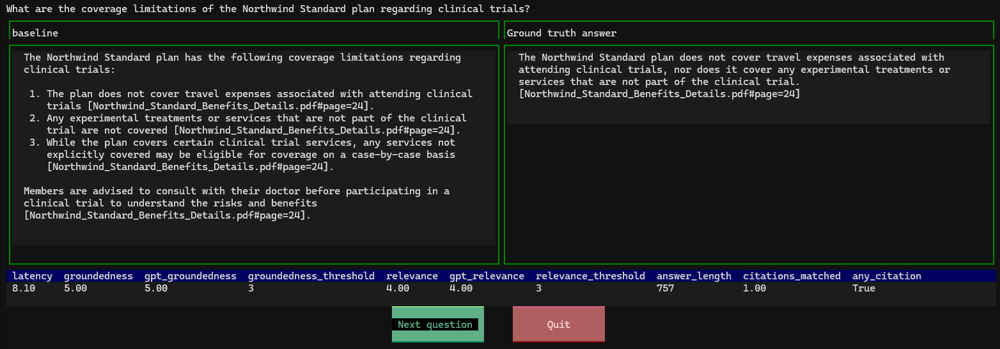

# Evaluating the RAG answer quality

[📺 Watch: (RAG Deep Dive series) Evaluating RAG answer quality](https://www.youtube.com/watch?v=lyCLu53fb3g)

Follow these steps to evaluate the quality of the answers generated by the RAG flow.

* [Deploy an evaluation model](#deploy-an-evaluation-model)
* [Setup the evaluation environment](#setup-the-evaluation-environment)
* [Generate ground truth data](#generate-ground-truth-data)
* [Run bulk evaluation](#run-bulk-evaluation)
* [Review the evaluation results](#review-the-evaluation-results)
* [Run bulk evaluation on a PR](#run-bulk-evaluation-on-a-pr)

## Deploy an evaluation model

1. Run this command to tell `azd` to deploy a GPT-4 level model for evaluation:

    ```shell
    cd deploy/aca
    azd env set USE_EVAL true
    ```

2. Set the capacity to the highest possible value to ensure that the evaluation runs relatively quickly. Even with a high capacity, it can take a long time to generate ground truth data and run bulk evaluations.

    ```shell
    azd env set AZURE_OPENAI_EVAL_DEPLOYMENT_CAPACITY 100
    ```

    By default, that will provision a `gpt-4o` model, version `2024-08-06`. To change those settings, set the azd environment variables `AZURE_OPENAI_EVAL_MODEL` and `AZURE_OPENAI_EVAL_MODEL_VERSION` to the desired values.

3. Then, run the following command to provision the model:

    ```shell
    azd provision
    ```

## Setup the evaluation environment

Make a new Python virtual environment and activate it. This is currently required due to incompatibilities between the dependencies of the evaluation script and the main project.

> [!IMPORTANT]
> python commands below must be run from the sample root folder, not from  `deploy/aca` folder

```bash
python -m venv .evalenv
```

```bash
source .evalenv/bin/activate
```

Install all the dependencies for the evaluation script by running the following command:

```bash
pip install -r evals/requirements.txt
```

## Generate ground truth data

Generate ground truth data by running the following command:

```bash
python evals/generate_ground_truth.py --numquestions=200 --numsearchdocs=1000 --env-file-path ./deploy/aca
```

The options are:

* `numquestions`: The number of questions to generate. We suggest at least 200.
* `numsearchdocs`: The number of documents (chunks) to retrieve from your search index. You can leave off the option to fetch all documents, but that will significantly increase time it takes to generate ground truth data. You may want to at least start with a subset.
* `kgfile`: An existing RAGAS knowledge base JSON file, which is usually `ground_truth_kg.json`. You may want to specify this if you already created a knowledge base and just want to tweak the question generation steps.
* `groundtruthfile`: The file to write the generated ground truth answwers. By default, this is `evals/ground_truth.jsonl`.

🕰️ This may take a long time, possibly several hours, depending on the size of the search index.

Review the generated data in `evals/ground_truth.jsonl` after running that script, removing any question/answer pairs that don't seem like realistic user input.


## Run bulk evaluation

Review the configuration in `evals/eval_config.json` to ensure that everything is correctly setup. You may want to adjust the metrics used. See [the ai-rag-chat-evaluator README](https://github.com/Azure-Samples/ai-rag-chat-evaluator) for more information on the available metrics.

By default, the evaluation script will evaluate every question in the ground truth data.
Run the evaluation script by running the following command:

```bash
python evals/evaluate.py --env-file-path ./deploy/aca
```

The options are:

* `numquestions`: The number of questions to evaluate. By default, this is all questions in the ground truth data.
* `resultsdir`: The directory to write the evaluation results. By default, this is a timestamped folder in `evals/results`. This option can also be specified in `evaluate_config.json`.
* `targeturl`: The URL of the running application to evaluate. By default, this is `http://localhost:8080/api/chat`. This option can also be specified in `evaluate_config.json`.

For more details about how to run locally the chat api see [Local Development with IntelliJ](local-development-intellij.md#running-the-spring-boot-chat-api-locally).
🕰️ This may take a long time, possibly several hours, depending on the number of ground truth questions, and the TPM capacity of the evaluation model, and the number of GPT metrics requested.

> [!IMPORTANT]
> Ground truth data is generated using a knowledge graph created out of the same search index used by the rag flow. It's based on [RAGAS evaluation framework](https://docs.ragas.io/en/stable/).If you want to learn more about data generation approach you can check [Tesset Generation for RAG](https://docs.ragas.io/en/stable/concepts/test_data_generation/rag/)

## Review the evaluation results

The evaluation script will output a summary of the evaluation results, inside the `evals/results` directory.

The evaluation uses the following default metrics (as configured in `evaluate_config.json`), with results available in the `summary.json` file:

* **gpt_groundedness**: Measures how well the answer is grounded in the retrieved context. Returns a pass rate and mean rating (1-5 scale).
* **gpt_relevance**: Evaluates the relevance of the answer to the user's question. Returns a pass rate and mean rating (1-5 scale).
* **answer_length**: Tracks the length of generated answers in characters (mean, max, min values).
* **latency**: Measures response time in seconds for each question (mean, max, min values).
* **citations_matched**: Counts how many answers include properly matched citations from the source documents.
* **any_citation**: Tracks whether answers include any citations at all.

> [!IMPORTANT]
> **gpt_groundedness** and **gpt_relevance** are built-in metrics provided by [Azure AI evaluation   sdk](https://learn.microsoft.com/en-us/azure/ai-foundry/how-to/develop/evaluate-sdk).
**answer length**, **latency**, **citations matched** and **any_citation** are custom metrics defined in [evaluate.py](../../evals/evaluate.py) or from [ai-rag-chat-evaluator project](https://github.com/Azure-Samples/ai-rag-chat-evaluator/blob/main/src/evaltools/eval/evaluate_metrics/code_metrics.py)

You can see a summary of results across all evaluation runs by running the following command:

```bash
python -m evaltools summary evals/results
```

Compare answers to the ground truth by running the following command:

```bash
python -m evaltools diff evals/results/baseline/
```

Compare answers across two runs by running the following command:

```bash
python -m evaltools diff evals/results/baseline/ evals/results/SECONDRUNHERE
```


