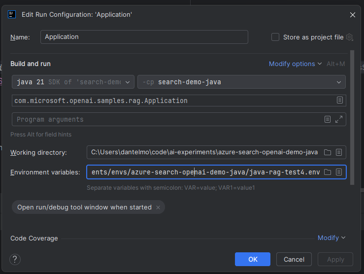

# Local Development with IntelliJ IDEA

This guide provides step-by-step instructions for running and debugging the Azure Search OpenAI Demo Java solution locally using IntelliJ IDEA IDE.

## Prerequisites

Before running the applications locally, ensure you have:

1. **Provisioned Azure Resources**: Run `azd up` or `azd provision` to create the required Azure resources
2. **IntelliJ IDEA**
3. **Java 17**: Required for the Spring Boot applications
4. **Node.js**: Version 20+ for the React frontend
5. **Maven**: For building Java applications

## Running the Spring Boot Chat API Locally

The Chat API is the main backend service that handles chat requests and integrates with Azure OpenAI and Azure AI Search.

### Step 1: Locate Environment Variables

After provisioning Azure resources with `azd`, your environment variables are stored in the Azure CLI environment folder. The location varies by operating system:

**Windows:**
```bash
deploy\aca\.azure\env\<environment-name>\.env
```

**Linux/macOS:**
```bash
deploy/aca/.azure/env/<environment-name>/.env
```

To find your environment name, run:
```bash
azd env list
```
the current env will be marked with DEFAULT = true

### Step 2: Configure IntelliJ IDEA Run Configuration

1. **Open the Project**: In IntelliJ IDEA, open the root project folder
2. **Navigate to Main Class**: Go to `app/backend/src/main/java/com/microsoft/openai/samples/rag/Application.java`
3. **Create Run Configuration**:
   - Right-click on the `Application.java` file
   - Select "Run 'Application'" or "Debug 'Application'"
   - This creates an initial run configuration

### Step 3: Customize Run Configuration

1. **Open Run Configurations**: Go to `Run` → `Edit Configurations...`
2. **Select the Application Configuration**: Choose the "Application" configuration for the chat API
3. **Set Environment Variables**:
   - In the "Environment variables" field, click the folder icon
   - Load the `.env` file from your Azure CLI environment folder
   - **Important**: Add `SPRING_PROFILES_ACTIVE=dev` directly in the environment variables section



4. **Set Main Class**: Verify the main class is `com.microsoft.openai.samples.rag.Application`

### Step 4: Run the Chat API

1. **Start the Application**: Click the "Run" or "Debug" button
2. **Verify Startup**: Check the console output for successful startup messages
3. **Test the API**: The API will be available at `http://localhost:8080`

To verify the API is running correctly:
```bash
curl http://localhost:8080/api/config
```

Expected response should include configuration details about the chat API.

## Running the Spring Boot Indexer API Locally

The Indexer API handles document processing and indexing operations.

### Step 1: Navigate to Indexer Main Class

Go to `app/indexer/microservice/src/main/java/com/microsoft/openai/samples/indexer/service/IndexerApplication.java`

### Step 2: Configure IntelliJ IDEA Run Configuration

1. **Create Run Configuration**:
   - Right-click on the `IndexerApplication.java` 
   - Select "Run 'IndexerApplication'" or "Debug 'IndexerApplication'"

2. **Edit Configuration**:
   - Go to `Run` → `Edit Configurations...`
   - Select the "IndexerApplication" configuration

### Step 3: Set Environment Variables

1. **Load Environment File**: Load the same `.env` file from your Azure CLI environment folder
2. **Add Profile Setting**: Add `SPRING_PROFILES_ACTIVE=dev` to the environment variables
4. **Set Main Class**: Verify it's `com.microsoft.openai.samples.indexer.service.IndexerApplication`

### Step 4: Run the Indexer API

1. **Start the Application**: Click "Run" or "Debug"
2. **Verify Startup**: Check console for successful startup
3. **Default Port**: The indexer typically runs on port `8070` when `SPRING_PROFILES_ACTIVE=dev` is set. Check your `application-dev.properties` file for the exact port configuration.


## Running the React Chat Web App Locally

The React frontend provides the user interface for the chat application.

### Step 1: Navigate to Frontend Directory

Open a terminal and navigate to the frontend directory:

```bash
cd app/frontend
```

### Step 2: Install Dependencies

Install the required Node.js dependencies:

```bash
npm install
```

This command will install all dependencies listed in `package.json`, including development dependencies.

### Step 3: Verify Chat API is Running

**Important**: The React web app must be started **after** the Chat API is running, as it reads configuration from `http://localhost:8080/api/config`.

Verify the Chat API is accessible:
```bash
curl http://localhost:8080/api/config
```

### Step 4: Start the Development Server

Start the React development server:

```bash
npm run dev
```

The development server will start and display output similar to:
```
  VITE v5.x.x  ready in xxx ms

  ➜  Local:   http://127.0.0.1:5173/
  ➜  Network: use --host to expose
```

### Step 5: Access the Application

1. **Open Browser**: Navigate to `http://localhost:5173/` (or the URL shown in the terminal)
2. **Verify Connection**: The app should load and connect to the backend API
3. **Test Chat Functionality**: Try sending a chat message to verify the end-to-end connection

## Debugging Tips

### Common Issues and Solutions

1. **Environment Variables Not Loading**:
   - Verify the `.env` file path is correct
   - Ensure all required Azure resources are provisioned
   - Check that `SPRING_PROFILES_ACTIVE=dev` is set

2. **Port Conflicts**:
   - Ensure ports 8080 (Chat API) and 8081 (Indexer API) are available
   - Check application properties files for port configurations

3. **Frontend Can't Connect to Backend**:
   - Verify the Chat API is running on port 8080
   - Check that `/api/config` endpoint is accessible

4. **Azure Authentication Issues**:
   - Verify your Azure CLI is logged in: `azd auth login`. If you own multiple subscriptions, ensure the correct one is set as default: `az account set --subscription <your-subscription-id>`


## Development Workflow

### Recommended Development Order

1. **Start Chat API**: Always start the backend Chat API first
2. **Start Indexer API**: Start the indexer if you need document processing functionality
3. **Start Frontend**: Start the React app last, ensuring it can connect to the backend

### Hot Reload Development

- **Java Applications**: IntelliJ IDEA supports hot reload for most code changes. For Spring Boot applications, consider using Spring Boot DevTools for automatic restarts
- **React Application**: The Vite development server provides hot module replacement (HMR) for instant updates during development

### Environment Management

Keep separate environment configurations for different development scenarios:
- **Local Development**: Use the dev profile with local debugging enabled
- **Integration Testing**: Use environment variables pointing to shared development resources
- **Production Testing**: Use production-like settings for final testing

## Next Steps

After successfully running the applications locally:

1. **Explore the Codebase**: Familiarize yourself with the project structure and key components
2. **Review Configuration**: Understand how environment variables control application behavior
3. **Test Features**: Verify all chat, search, and indexing functionalities work as expected
4. **Set Up Testing**: Configure unit and integration tests for your development workflow

